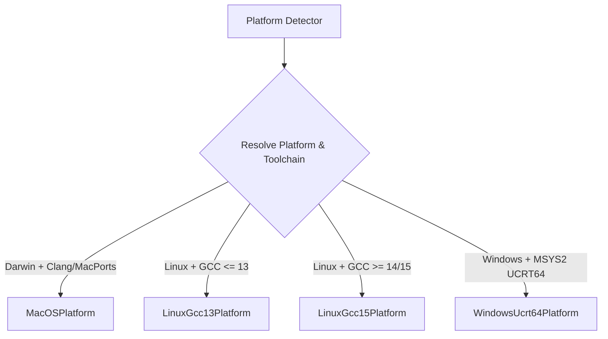
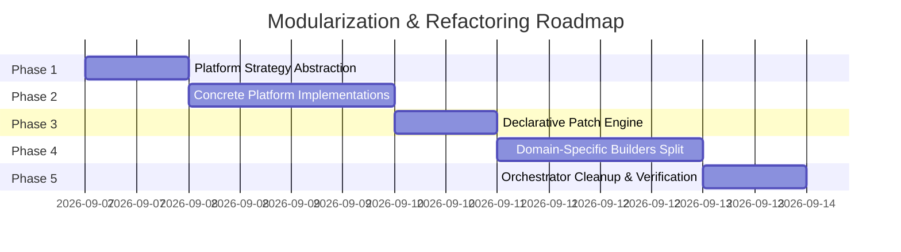

# Developer Architecture & Refactoring Plan: Modular Platform & Component Split

## 1. Executive Summary

The `ffmpeg_builder` system has grown into a mature, multi-platform build framework supporting FFmpeg 8.1 and 9.0 across macOS, Linux (GCC 13 & GCC 15/16), and Windows 11 (MSYS2 UCRT64). However, [builder.py](builder.py) (~2,600 lines) has become a monolithic orchestrator containing:
1. Low-level platform environment setup and path normalization.
2. Toolchain-specific quirks and compiler flag workarounds (C23 keyword collisions, header omissions in GCC 15/16, OpenMP variations on Darwin).
3. In-line text-based source patching logic.
4. 15 custom component build routines.
5. Standard build-system runners (CMake, Meson, Autotools, Cargo, Make-only).

This document specifies the architecture, design principles, and modular breakdown for splitting [builder.py](builder.py) and the surrounding build engine into clean, decoupled layers organized by **platforms/toolchains** and **component domains/versions**.

---

## 2. Source Code & Platform Analysis

### 2.1 Target Platform & Compiler Matrix



#### A. macOS (Darwin - Apple Clang & MacPorts Clang)
- **Toolchain Peculiarities**:
  - Apple Clang does not support `-fopenmp`; OpenMP builds require MacPorts `clang-mp-*` or Homebrew `libomp`.
  - C++ standard library linking requires `-lc++` (not `-lstdc++`).
  - Shared library runtime linking utilizes `@rpath`, `@loader_path`, and post-build Mach-O rewriting (`install_name_tool` and ad-hoc `codesign`).
  - Autotools requires `glibtoolize` resolution.
- **Key Modules Affected**:
  - OpenMP library path discovery: [builder.py](builder.py#L369-L395).
  - Darwin extra libraries (`-lc++`, `-llcms2` for `libjxl` and `libvmaf`): [builder.py](builder.py#L2747-L2810).
  - Release bundle relocation: [release_bundle.py](release_bundle.py#L63-L130).

#### B. Linux - GCC 13 (Ubuntu 24.04.4 LTS)
- **Toolchain Peculiarities**:
  - Standards: Defaults to C17/C11 and C++17.
  - Multiarch layout: Library packages reside in architecture triplets (e.g., `/usr/lib/x86_64-linux-gnu/pkgconfig`).
  - Static Linking: Full static builds use `-static -fPIC` with `-lgcc_eh` replacements in `.pc` files.
  - Hardware Acceleration: Native VAAPI (`/dev/dri/renderD*`), Vulkan ICD loader (`libvulkan.so.1`), and ROCm.
- **Key Modules Affected**:
  - Multiarch pkgconfig probing: [platform_detect.py](platform_detect.py#L202-L220), [builder.py](builder.py#L525-L536).
  - Static library flag adjustments (`srt.pc` `-lgcc_s` to `-lgcc_eh`): [builder.py](builder.py#L2290-L2296).

#### C. Linux - GCC 15 / GCC 16 (Fedora 44 / Ubuntu 26.04.1)
- **Toolchain Peculiarities**:
  - Default C23 Standard: Keywords `bool`, `true`, and `false` are part of core C, breaking legacy code defining `typedef int bool;`.
  - Header Refactoring in `libstdc++`: `<cstdint>` is no longer included transitively via `<limits>` or standard headers; types like `uint8_t` are undeclared without explicit inclusion.
  - Stricter Assembly and Deprecations: OpenSSL x86_64 inline assembly breaks under strict `-std=c11`, requiring `-std=gnu11`.
- **Key Modules Affected**:
  - `xvidcore` bool typedef gating: [builder.py](builder.py#L1128-L1155).
  - `x265` `json11.cpp` `<cstdint>` injection: [builder.py](builder.py#L1620-L1642).
  - `openssl` `configdata.pm` `-std=gnu11` override: [builder.py](builder.py#L1508-L1528).

#### D. Windows - MSYS2 UCRT64 (GCC 15/16)
- **Toolchain Peculiarities**:
  - Dual Runtime Execution: Direct Win32 PE invocation for tools (`cmake.exe`, `ninja.exe`, `python.exe`) vs POSIX shell wrapping via `sh.exe` for `./configure` and `./autogen.sh`.
  - Path Duality: POSIX style (`/d/...`) for bash scripts vs Windows drive letters (`D:/...` / 8.3 short paths) for CMake, Meson, and native compilers.
  - `PKG_CONFIG_PATH` delimiter: Colon (`:`) for bash execution, semicolon (`;`) for Python direct subprocess execution (Meson/CMake).
  - Concurrency & Sockets: FFmpeg uses `--enable-w32threads` instead of POSIX threads; network libraries require `-lws2_32 -lrpcrt4`; static libraries (like `libzmq`) require `-DZMQ_STATIC`.
- **Key Modules Affected**:
  - Windows path normalization and 8.3 conversion: [builder.py](builder.py#L319-L360).
  - PKG_CONFIG_PATH dual formatters: [builder.py](builder.py#L407-L440).
  - Meson/CMake UCRT64 overrides: [builder.py](builder.py#L1227-L1290).

---

### 2.2 Component Version Differences

1. **FFmpeg (8.1 vs 9.0)**:
   - Version 8.1: Standard configuration with legacy flags.
   - Version 9.0: Requires Vulkan context include patch in `ffplay_renderer.c`, updated `--enable-libplacebo` requirements, and dynamic flag selection based on `ffmpeg_configure_flags_by_version` in [components.yaml](components.yaml).
2. **NV-Codec (12.2 vs 13.1)**:
   - Version 12.2.x required for FFmpeg 8.1 NVENC compatibility; 13.1.x targets FFmpeg 9.0+.
3. **OpenSSL / Crypto Stack**:
   - GPL vs Non-GPL crypto configurations (GnuTLS + Nettle + GMP vs OpenSSL).

---

## 3. Target Modular Architecture

The refactored build architecture replaces the monolithic [builder.py](builder.py) with dedicated subpackages:

```
ffmpeg_builder/
├── platforms/                  # Platform & Toolchain Strategy Layer
│   ├── __init__.py             # Exports BasePlatformStrategy and resolver
│   ├── base.py                 # Abstract BasePlatformStrategy
│   ├── context.py              # PlatformContext protocol & data structures
│   ├── darwin.py               # MacOSPlatform (Apple/MacPorts Clang, OpenMP, Mach-O)
│   ├── linux_gcc13.py          # LinuxGcc13Platform (Ubuntu 24.04, standard C11/C++17)
│   ├── linux_gcc15.py          # LinuxGcc15Platform (Fedora 44, C23 rules, <cstdint>)
│   ├── windows_ucrt64.py       # WindowsUcrt64Platform (MSYS2, w32threads, path translation)
│   └── resolver.py             # Strategy resolver factory
│
├── patches/                    # Declarative Source Patch Engine
│   ├── __init__.py             # PatchRegistry and applicator functions
│   ├── base.py                 # SourcePatch base class and assertion validators
│   ├── c23_fixes.py            # xvidcore bool patch, OpenSSL gnu11 config patch
│   ├── cxx_headers.py          # x265 cstdint patch
│   ├── darwin_patches.py       # libjxl deps.sh realpath guard, libvorbis cpusubtype
│   └── ffmpeg_patches.py       # FFmpeg 9 ffplay Vulkan header patch
│
├── builders/                   # Modular Component Builders
│   ├── __init__.py             # Builder registry export
│   ├── base.py                 # Common build system runners (autotools, cmake, meson, cargo)
│   ├── codecs/                 # Codec builders
│   │   ├── __init__.py
│   │   ├── x264.py             # x264 custom builder
│   │   ├── x265.py             # x265 multi-bitdepth builder
│   │   ├── vpx.py              # libvpx custom builder
│   │   ├── jxl.py              # libjxl custom builder
│   │   ├── zimg.py             # zimg custom builder
│   │   └── vorbis.py           # libvorbis custom builder
│   ├── crypto/                 # Cryptography builders
│   │   ├── __init__.py
│   │   └── openssl.py          # OpenSSL builder
│   ├── graphics/               # Graphics & filtering builders
│   │   ├── __init__.py
│   │   ├── glslang.py          # glslang builder
│   │   ├── placebo.py          # libplacebo + Vulkan builder & .pc rewriter
│   │   └── vmaf.py             # libvmaf + CUDA builder
│   ├── network/                # Network protocol builders
│   │   ├── __init__.py
│   │   ├── srt.py              # SRT builder & .pc rewriter
│   │   └── zmq.py              # libzmq builder & Windows static patch
│   ├── tools/                  # Build tools
│   │   ├── __init__.py
│   │   ├── ninja.py            # Ninja bootstrap builder
│   │   └── meson.py            # Meson bootstrap builder
│   └── ffmpeg/                 # FFmpeg orchestration
│       ├── __init__.py
│       └── ffmpeg.py           # FFmpeg configure, flag assembly, compilation
│
├── builder.py                  # Lean orchestrator coordinating downloads, state, platforms, builders
├── build_steps.py              # Shared execution helpers (run_step, run_make, run_install)
├── component_builders.py       # Dispatch table routing custom builders to builders/*
└── components.py               # Component definitions and YAML registry loader
```

---

## 4. Key Design Patterns & Interfaces

### 4.1 Platform Strategy Pattern (`platforms/base.py`)

```python
class BasePlatformStrategy(ABC):
    """Abstract strategy defining platform and compiler behaviors."""

    @abstractmethod
    def setup_environment(self, context: PlatformContext) -> Dict[str, str]:
        """Construct environment variables (PATH, PKG_CONFIG_PATH, CFLAGS, LDFLAGS, etc.)."""

    @abstractmethod
    def normalize_path(self, path: Path | str) -> str:
        """Normalize path for build scripts and flags."""

    @abstractmethod
    def get_pkg_config_path(self, workspace: Path, for_posix_shell: bool = False) -> str:
        """Format PKG_CONFIG_PATH according to execution context."""

    @abstractmethod
    def get_cpp_runtime_lib(self) -> str:
        """Return C++ runtime library (-lc++ or -lstdc++)."""

    @abstractmethod
    def get_ffmpeg_threading_flag(self) -> str:
        """Return threading configure flag (--enable-pthreads or --enable-w32threads)."""

    @abstractmethod
    def get_extra_libs(self) -> str:
        """Return platform-specific base libraries."""
```

### 4.2 Declarative Source Patching (`patches/base.py`)

```python
@dataclass
class SourcePatch:
    name: str
    component_name: str
    target_file: str  # relative path within source_dir
    anchor: str
    replacement: str
    condition: Callable[[Component, PlatformContext], bool]
    must_remove: Optional[str] = None
    must_contain: Optional[str] = None

    def apply(self, source_dir: Path, component: Component, context: PlatformContext) -> None:
        """Apply patch with safety assertions."""
```

---

## 5. Phase-by-Phase Implementation Roadmap

The refactoring is divided into five distinct, test-verified phases:



- **[docs/phase1_plan.md](phase1_plan.md)**: **Phase 1 — Architecture & Platform Strategy Abstraction**
  - Define `BasePlatformStrategy`, `PlatformContext`, and toolchain capability detection interfaces.
  - Refactor compiler version probing in `platform_detect.py` and `system_report.py`.
- **[docs/phase2_plan.md](phase2_plan.md)**: **Phase 2 — Concrete Platform & Toolchain Implementations**
  - Implement `MacOSPlatform`, `LinuxGcc13Platform`, `LinuxGcc15Platform`, and `WindowsUcrt64Platform`.
  - Implement `PlatformResolver` to automatically select strategy based on OS, compiler version, and environment.
- **[docs/phase3_plan.md](phase3_plan.md)**: **Phase 3 — Declarative & Versioned Source Patch Engine**
  - Extract all ad-hoc source patching into `patches/` modules.
  - Implement validation hooks ensuring patches fail fast if component sources change.
- **[docs/phase4_plan.md](phase4_plan.md)**: **Phase 4 — Domain-Specific Component Builders Modularization**
  - Modularize the 15 custom builders into domain subpackages (`codecs`, `crypto`, `graphics`, `network`, `tools`, `ffmpeg`).
  - Wire custom builders to `component_builders.py`.
- **[docs/phase5_plan.md](phase5_plan.md)**: **Phase 5 — Orchestrator Refactoring, Integration Testing, and Verification**
  - Streamline `FFmpegBuilder` in [builder.py](builder.py) into a clean orchestration facade.
  - Verify all unit tests, mypy baseline, and black formatting.

---

## 6. Backward Compatibility & Verification Strategy

1. **Public API Preservation**:
   - `FFmpegBuilder` public methods (`build_component`, `get_build_env`, `prefetch_downloads`, `make_release_bundle`) remain identical.
   - `CUSTOM_BUILDERS` dispatch interface in [component_builders.py](component_builders.py) remains backward-compatible.
2. **State & Resume Compatibility**:
   - `ComponentStatus` states and `workspace/build_state.json` persistence remain unchanged.
3. **Unit Test Verification**:
   - All tests in [tests/](tests/) must pass across all test runs.
   - New tests added to [tests/test_builder_split.py](tests/test_builder_split.py) covering each platform strategy and builder module.
4. **Toolchain Quality Gates**:
   - `python scripts/check_mypy_baseline.py` must stay green.
   - `black --check .` formatting compliance.
